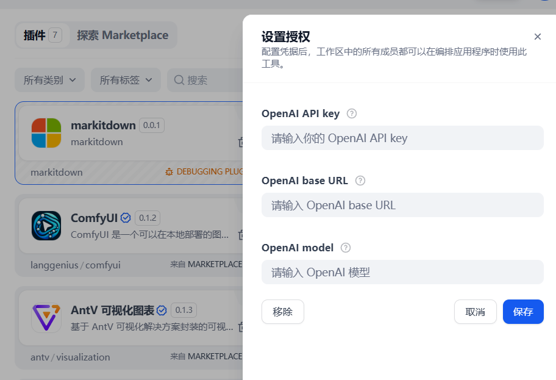

## Markitdown

## Overview

MarkItDown is a lightweight Python utility for converting various files to Markdown for use with LLMs and related text analysis pipelines. It is most comparable to [textract](https://github.com/deanmalmgren/textract), but with a focus on preserving important document structure and content as Markdown (including headings, lists, tables, links, etc.). While the output is often reasonably presentable and human-friendly, it is primarily designed to be consumed by text analysis tools and may not be the best option for high-fidelity document conversions intended for human consumption.

MarkItDown currently supports conversion from:

- PDF
- PowerPoint
- Word
- Excel
- Images (EXIF metadata and OCR)
- Audio (EXIF metadata and speech transcription)
- HTML
- Text-based formats (CSV, JSON, XML)
- ZIP files (iterates over contents)
- YouTube URLs
- EPubs
- ... and more!

## Configuration

### 1. Configure the tool in Dify

If you do not want to use Azure Document Intelligence for conversion or Large Language Models for image descriptions, simply click the "Save" button.

#### Azure Document Intelligence

On the Dify navigation page, go to `Tools > MarkItDown > Authorize` and provide the following details to enable Microsoft Document Intelligence for conversion:
- Azure Document Intelligence endpoint
- Azure Document Intelligence API version
- Azure Document Intelligence credentials
- Azure API key

#### Large Language Models for Image Descriptions

On the Dify navigation page, go to `Tools > MarkItDown > Authorize` and provide the following details to enable Large Language Models for image descriptions:
- OpenAI API key
- OpenAI base URL
- OpenAI model

### 2. Use the tool

You can use the MarkItDown tool in the following types of applications:

#### Workflow Applications

Workflow applications support adding Markitdown tool nodes.
